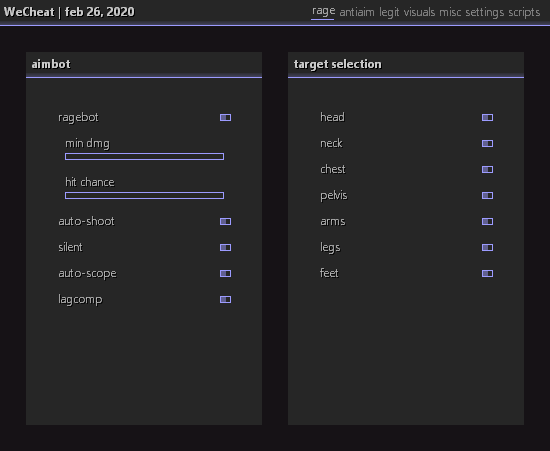

# OXUI
OXUI Framework - oxy's static GUI framework

# DEMO


# GETTING STARTED

Creating Window Objects:
```cpp
object = std::make_shared< oxui::object >( args );
```

Creating Your First GUI:
```cpp
panel = std::make_shared< oxui::panel >( ); {
  window = std::make_shared< oxui::window >( oxui::rect( 200, 200, 550, 425 ), OSTR( "title" ) ); {
    window->bind_key( VK_INSERT );

    auto tab = std::make_shared< oxui::tab >( OSTR( "tab 1" ) ); {
      {
        auto group_1 = std::make_shared< oxui::group >( OSTR( "group 1" ) ); {
          group_1->add_element( std::make_shared< oxui::checkbox >( OSTR( "checkbox" ) ) );
          group_1->add_element( std::make_shared< oxui::slider >( OSTR( "slider" ), 0.0, 0.0, 100.0 ) );
          group_1->add_element( std::make_shared< oxui::button >( OSTR( "button" ), [ & ] ( ) { std::exit( 0 ); } ) );
        
          tab->add_group( group_1 );
        }
      
        auto group_2 = std::make_shared< oxui::group >( OSTR( "group 2" ) ); {
          tab->add_group( group_2 );
        }
      
        tab->add_columns( 2 );
      }
      
      {
        auto group_3 = std::make_shared< oxui::group >( OSTR( "group 3" ) ); {
          tab->add_group( group_3 );
        }
      
        auto group_4 = std::make_shared< oxui::group >( OSTR( "group 4" ) ); {
          tab->add_group( group_4 );
        }
      
        tab->add_columns( 2 );
      }
    }
    
    auto tab = std::make_shared< oxui::tab >( OSTR( "tab 2" ) ); {
      auto group_1 = std::make_shared< oxui::group >( OSTR( "group 1" ) ); {
        tab->add_group( group_1 );
        tab->add_columns( 1 );
      }
      
      {
        auto group_2 = std::make_shared< oxui::group >( OSTR( "group 2" ) ); {
          tab->add_group( group_2 );
        }
      
        auto group_3 = std::make_shared< oxui::group >( OSTR( "group 3" ) ); {
          tab->add_group( group_3 );
        }
      
        tab->add_columns( 2 );
      }
    }
        
    panel->add_window( window );
  }
}
```

Rendering:
Function oxui::panel::render requires you to pass in the current time (in seconds) to allow proper handling of animations.
```cpp
panel->render( current_time );
```

Destroying Objects for Device Reset:
```cpp
panel->destroy( );
```


Device Reset:
```cpp
panel->reset( );
```

Running Input Handler:
```cpp
window->wndproc( hwnd, msg, wparam, lparam );
```

Finding / Grabbing GUI Object Values:
Function oxui::window::find_obj will return a pointer to the stored value inside a control on a given window.
```cpp
#define FIND( type, object, tab_name, group_name, object_name, type_name ) \
static auto& object = *( type* ) window->find_obj( OSTR( tab_name ), OSTR( group_name ), OSTR( object_name ), type_name )
```

Checking if a GUI is Open:
```cpp
window->open
```

Instruction Summary:
```
1. Create GUI objects.
2. Register GUI input handler, pass input to handler.
3. Render GUI.
4. Destroy or reset GUI objects as needed.
```
